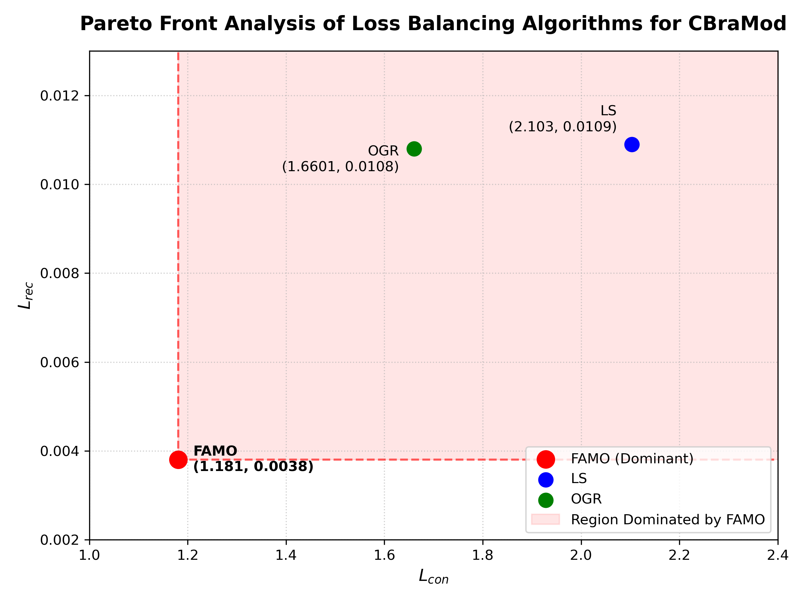
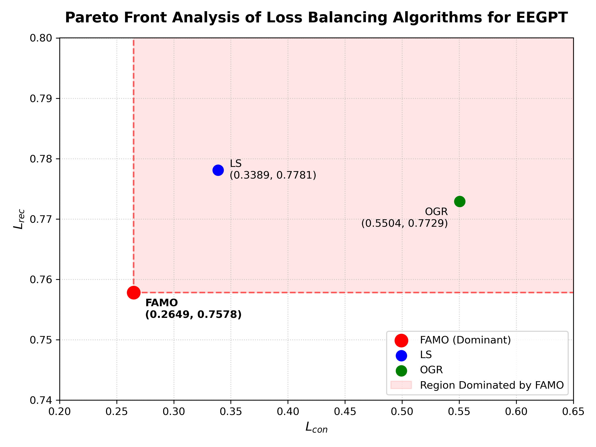
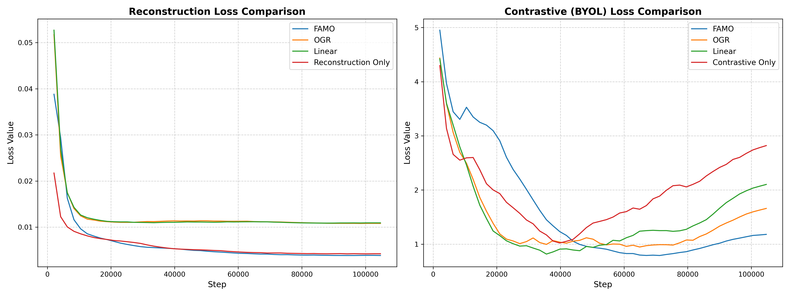
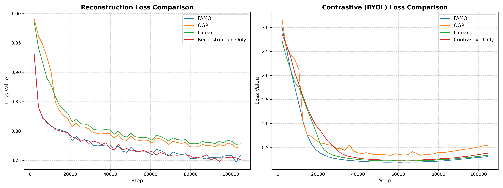

# Multi-Task Learning for EEG Foundation Model Pretraining

**Investigating gradient conflicts, multi-objective optimization, and transferable EEG representations through self-supervised multi-task pretraining.**

[](#implementation) [](#implementation) [](#research-question)

> **Research internship project — Télécom Paris / Institut Polytechnique de Paris (2026).** This repository accompanies the internship report *Multi-task Learning for Pretraining EEG Foundation Models*. 

## Overview

Electroencephalography (EEG) foundation models aim to learn transferable representations from large-scale, unlabeled brain-signal recordings. Much EEG self-supervised pretraining emphasizes masked reconstruction. Adding a complementary contrastive learning objective can enrich the representation—but simply averaging the task losses may lead to **gradient conflicts** or **gradient dominance**, leaving one objective under-optimized.

This project studies **multi-task learning (MTL) as a multi-objective optimization problem** and compares ways to balance reconstruction and contrastive objectives during EEG foundation-model pretraining. Experiments use two encoder architectures (**CBraMod** and **EEGPT**), analyze optimization dynamics, and assess frozen-encoder transfer to four downstream EEG datasets.

### Research question

> How can EEG foundation models be pretrained with multiple self-supervised objectives while mitigating conflicting or imbalanced gradients at an acceptable computational cost?

### Main work

- Built a configurable PyTorch Lightning / Hydra experimental framework for multi-objective EEG pretraining and downstream evaluation.
- Compared **Linear Scalarization (LS)**, **Overfitting-to-Generalization Ratio (OGR)** weighting, and **Fast Adaptive Multitask Optimization (FAMO)**, alongside single-task ablations.
- Investigated gradient alignment, gradient dominance, and Pareto relationships of reconstruction and contrastive losses.
- Studied FAMO's *amortized* task-weight adaptation, including a two-dimensional toy experiment visualizing its behavior.
- Evaluated representation transfer using **linear probing** on BCIC-IV-2a, PhysioNet-MI, KaggleERN, and Sleep-EDFx.

## Methods

### Self-supervised pretraining

The shared EEG encoder feeds two complementary training objectives:

```text
                     Unlabeled EEG segments
                              |
                   Augmentation and masking
                              |
                      Shared EEG encoder
                       (EEGPT / CBraMod)
                         /           \
                        v             v
               Masked reconstruction  Contrastive representation learning
                        |             |
                      L_rec         L_con
                         \           /
                          v         v
                      Multi-task optimizer
                         LS / OGR / FAMO
                              |
                      Shared encoder update
```

The pretraining code provides reconstruction and multiple contrastive/BYOL-style task variants; the exact task combination is selected in the Hydra YAML configuration. The study in the report focuses on reconstruction and contrastive learning.

### Optimization strategies

Let $L_{\mathrm{rec}}$ and $L_{\mathrm{con}}$ be the task losses and $g_i=\nabla_\theta L_i$ their gradients.

| Strategy | Principle | Role in this study |
| --- | --- | --- |
| **Linear Scalarization (LS)** | Minimize a fixed weighted combination of task losses | Multi-task baseline |
| **OGR** | Adapt loss weights using generalization/overfitting signals | Loss-balancing comparison |
| **FAMO** | Adapt weights to balance relative task improvement, using changes in log-losses to approximate gradient interactions | Main gradient-balancing method under investigation |
| **Single-task baselines** | Train using reconstruction alone or contrastive learning alone | Isolate contributions from each objective |

Gradient conflict arises when an update that improves the aggregate objective works against an individual task; gradient dominance arises when task contributions to an update become highly uneven. In the experiments, Pareto dominance is used to assess whether one final loss pair improves on another **in both objectives**.

FAMO avoids explicit per-task backward passes for task-weight updates, but its standard implementation evaluates task losses again after the model update. The internship report estimates **approximately 30–50% more pretraining time than LS** in its experimental setting; thus, it should not be described as overhead-free.

## Experimental results

### Pretraining: Pareto and gradient analysis

The report finds that FAMO reaches loss pairs that Pareto-dominate the compared LS and OGR runs in the reported pretraining setting, and examines task-gradient cosine similarities to explain the resulting optimization behavior. These observations concern the *reported experiments*, not a general guarantee of convergence or superiority for every dataset.

| CBraMod loss comparison | EEGPT loss comparison |
| --- | --- |
|  |  |

### Downstream linear-probe performance

**Reported scores (%)** from the internship report. Larger is better for the reported dataset metrics.

| Backbone | Pretraining strategy | BCIC-IV-2a | PhysioNet-MI | KaggleERN | Sleep-EDFx |
| --- | --- | ---: | ---: | ---: | ---: |
| CBraMod | Reconstruction only | 54.17 | 57.48 | 70.66 | 73.76 |
| CBraMod | Contrastive only | 45.85 | 54.30 | 70.77 | 73.95 |
| CBraMod | LS | 40.64 | 51.27 | **70.79** | 72.91 |
| CBraMod | OGR | 43.29 | 51.53 | 69.54 | 69.95 |
| **CBraMod** | **FAMO** | **56.97** | **57.87** | 70.14 | **78.46** |
| EEGPT | Reconstruction only | 51.88 | 54.09 | 69.19 | 77.19 |
| EEGPT | Contrastive only | 52.75 | 54.07 | 68.93 | **78.92** |
| EEGPT | LS | 52.26 | 54.35 | 69.52 | 75.51 |
| EEGPT | OGR | **55.03** | 54.04 | **70.32** | 77.12 |
| **EEGPT** | **FAMO** | 53.60 | **54.42** | 70.31 | 78.88 |

FAMO leads on three of the four **CBraMod** evaluations (BCIC-IV-2a, PhysioNet-MI, Sleep-EDFx) and achieves competitive results on **EEGPT**. It does **not** win every comparison: LS performs best on CBraMod/KaggleERN, while other methods top several EEGPT evaluations. The downstream results therefore support a qualified conclusion rather than a universal improvement claim.

### Training dynamics

| CBraMod training losses | EEGPT training losses |
| --- | --- |
|  |  |

## Data and evaluation protocol

### Pretraining dataset — Temple University Hospital EEG Corpus (TUEG)

The pretraining data were drawn from the **[Temple University Hospital EEG Data Corpus (TUH EEG Corpus / TUEG)](https://doi.org/10.3389/fnins.2016.00196)**, a collection of clinical EEG recordings described by Obeid and Picone (2016) [1]. The experiments used a **processed subset totaling approximately 1,200 hours of EEG**; this figure describes the data used in this study, **not the full size of TUEG**.

The preprocessing consisted of:

- Selecting **19 channels** from the standard international 10–20 EEG montage.
- Discarding the first and last minute of each recording.
- Applying a **0.3–75 Hz band-pass filter** and a **60 Hz notch filter**.
- Resampling to **200 Hz** and dividing recordings into non-overlapping **16-second windows**.
- Rejecting windows exceeding **100 µV** in maximum amplitude, then normalizing retained signals to **[-1, 1]**.

Pretraining combined masked reconstruction and contrastive learning with augmented views and a momentum target encoder. Access to the original corpus and the project-specific preprocessing pipeline is needed to reproduce this training subset; the raw recordings are not distributed in this repository.

### Downstream datasets

Downstream evaluations cover:

- **BCIC-IV-2a:** motor-imagery classification.
- **PhysioNet-MI:** motor-imagery EEG classification.
- **KaggleERN:** event-related negativity classification.
- **Sleep-EDFx:** sleep-stage classification.

The report uses subject-wise cross-validation and linear probing, with the pretrained encoder frozen and a trainable adapter/classification head. **Dataset acquisition, preprocessing, local data paths, and pretrained checkpoint files must be configured separately**; raw datasets and trained weights are not supplied as a ready-to-run bundle in this archive.

## Implementation

**Core stack:** Python, PyTorch, PyTorch Lightning, Hydra/OmegaConf, TensorBoard; LMDB-backed EEG loading and Slurm scripts are used in the project workflow. The code includes EEGPT and CBraMod implementations, modular task definitions, MTL weighting strategies, and scripts for training and visualization.

```text
Multi-task-Learning-for-EEGFM/
├── configs/
│   ├── dataset/               # Pretraining and downstream dataset definitions
│   ├── model/                 # EEGPT / CBraMod configurations
│   ├── weight_method/         # LS, OGR, FAMO settings
│   └── example_config_*.yaml  # Experiment templates
├── src/
│   ├── pretrain.py            # Lightning pretraining entry point
│   ├── train.py               # Downstream training/evaluation entry point
│   ├── pretrain_module/       # Backbone-specific pretraining modules/tasks
│   ├── models/                # EEGPT / CBraMod encoders and heads
│   ├── mtl/                   # Weighting strategies and gradient monitoring
│   ├── data/                  # EEG dataloaders and dataset integrations
│   └── module/downstream/     # Downstream task modules
├── script/
│   ├── pretrain/              # Slurm pretraining runs and ablations
│   └── downstream/            # Linear-probe and fine-tuning runs
├── toy_experiments/           # Low-dimensional optimization experiments
├── tensorboard_vis/           # Analysis scripts, exported metrics and figures
└── requirements.txt           # Requirements
```

### Configuration and execution

This is a **research codebase**, not a packaged one-command application. Its recorded experiments rely on external dataset directories and checkpoints, and many shell scripts contain paths and Conda settings specific to the original compute environment.

1. Environment setup

Clone the repository and install the required dependencies:

```bash
git clone https://github.com/ttnamnktp/Multi-task-Learning-for-EEGFM.git
cd Multi-task-Learning-for-EEGFM

python -m venv .venv
source .venv/bin/activate

pip install -r requirements.txt
```

2. Update `configs/dataset/...` to reference your own EEG datasets, and adjust model/optimizer settings as needed.

3. Choose an existing example YAML config. The entry-point scripts use Hydra's default `config_name='config'`, but the supplied archive has no `configs/config.yaml`; therefore, pass an explicit `--config-name` as shown below.

4. Launch from the repository root:

```bash
# Example: CBraMod + FAMO pretraining configuration
python -m src.pretrain --config-name example_config_pretrain_famo_cbramod_cons_reg \
  dataset.datasets_dir=/path/to/pretraining_lmdb

# Example: downstream experiment (requires a matching pretrained checkpoint)
python -m src.train --config-name example_config_downstream \
  dataset.datasets_dir=/path/to/downstream_data \
  model.pretrained_ckpt=/path/to/pretrained.ckpt
```

The commands are **entry points verified from source**, not end-to-end runs tested on a clean environment. Exact downstream model/config overrides depend on the chosen dataset, backbone and task. For examples of the original Slurm workflow, inspect `script/pretrain/` and `script/downstream/`, replacing cluster-specific paths before running them elsewhere.

**Checkpoint caution:** `src/train.py` tests `best` and `last` checkpoints and subsequently deletes its checkpoint directory. Review that cleanup behavior before adapting the script to retain artifacts.

## References

This is an **internship research project**, not a claim to have introduced EEGPT, CBraMod, OGR, or FAMO. The work adapts and evaluates established methods for multi-task EEG pretraining. References follow a consistent numbered, IEEE-inspired format, with links to the papers.

[1] I. Obeid and J. Picone, “The Temple University Hospital EEG Data Corpus,” *Frontiers in Neuroscience*, vol. 10, art. 196, 2016. [doi:10.3389/fnins.2016.00196](https://doi.org/10.3389/fnins.2016.00196).

[2] G. Wang *et al*., “EEGPT: Pretrained Transformer for Universal and Reliable Representation of EEG Signals,” in *Advances in Neural Information Processing Systems (NeurIPS)*, vol. 37, pp. 39249–39280, 2024. [Paper](https://proceedings.neurips.cc/paper_files/paper/2024).

[3] J. Wang *et al*., “CBraMod: A Criss-Cross Brain Foundation Model for EEG Decoding,” in *International Conference on Learning Representations (ICLR)*, 2025. [Paper](https://openreview.net/forum?id=NPNUHgHF2w).

[4] B. Liu, Y. Feng, P. Stone, and Q. Liu, “FAMO: Fast Adaptive Multitask Optimization,” in *Advances in Neural Information Processing Systems (NeurIPS)*, vol. 36, pp. 57226–57243, 2023. [Paper](https://mlanthology.org/neurips/2023/liu2023neurips-famo/).

[5] W. Wang, D. Tran, and M. Feiszli, “What Makes Training Multi-Modal Classification Networks Hard?,” in *Proceedings of the IEEE/CVF Conference on Computer Vision and Pattern Recognition (CVPR)*, pp. 12695–12705, 2020. [Paper](https://openaccess.thecvf.com/content_CVPR_2020/html/Wang_What_Makes_Training_Multi-Modal_Classification_Networks_Hard_CVPR_2020_paper.html).

[6] T. Yu *et al*., “Gradient Surgery for Multi-Task Learning,” in *Advances in Neural Information Processing Systems (NeurIPS)*, vol. 33, pp. 5824–5836, 2020. [Paper](https://arxiv.org/abs/2001.06782).

For detailed derivations, hyperparameters, ablations, and the full bibliography, see the internship report *Multi-task Learning for Pretraining EEG Foundation Models* (July 2026).

## Status

**Research prototype / internship project.** The experimental results above are transcribed from the internship report. This repository contains research scripts and analysis artifacts and is not guaranteed to reproduce the full report without the original data, environment and checkpoints.
